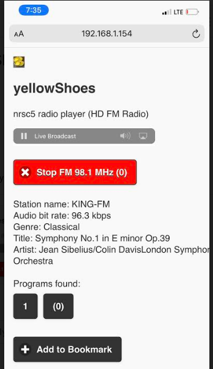

# Playback on IOS Devices


IOS devices (at least the ones I've access to) seem to have trouble playing "live" `wav` files using  Chunked transfer encoding. 

The work-around is to convert the lossless, uncompressed `wav` on-the-fly to compressed and lossy `mp3` format. 

And this brings us to `lame` -  a software encoder that converts a digitized WAV audio file into the MP3 audio coding file format. 

## Requirements
If you wish to use Apple devices with `yellowShoes` you must setup [`lame`](https://lame.sourceforge.io/index.php) mp3 encoder on your backend. The `lame` binary must be in your `PATH`. 

Without `lame`, you can still use non-IOS devices to stream.


## lame 
On linux hosts, setup lame as:
```bash
$ sudo apt-get install lame
```
If you have another Operating System, set up `lame` as appropriate to your environment.


