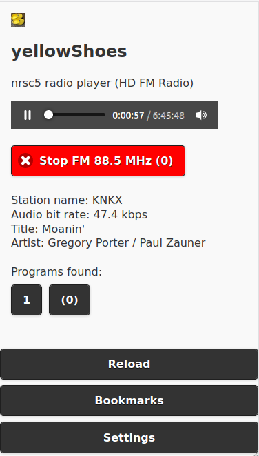

# yellowShoes
nrsc5 (HD FM) radio player 

## Description
If you have an <a href="https://www.amazon.com/gp/product/B011HVUEME">SDR Dongle</a> that can receive <a href="https://en.wikipedia.org/wiki/HD_Radio">NRSC-5</a> digital radio stations, you can use `yellowShoes` as the playback and control UI (User-interface). Navigate to your `yellowShoes` instance from a decent web browser, and you're good to go!

# Requirements
* You must have <a href="https://github.com/theori-io/nrsc5">nrsc5</a> compiled and installed. The `nrsc5` binary must be in your `PATH`. 
* Optional Requirement: If you want mp3 playback (or have IOS devices), you will need `lame` encoder binary in your `PATH`. See [IOS Playback](./IOS/README.md) section.

# Setup 
* Setup <a href="https://github.com/theori-io/nrsc5">nrsc5</a>  
* Download `yellowShoes` to a folder. (Either download the [release](https://github.com/evuraan/yellowShoes/releases), or clone this repo, or download and extract the <a href="https://github.com/evuraan/yellowShoes/archive/refs/heads/main.zip">Zip file</a>.)
* Go into the <a href="./bin">`bin`</a> folder, and launch the binary appropriate for your platform.
* Launch a browser and navigate to `http://<Your_Address>:Port/main` to launch the UI. (Default port = 8113).


```bash
evuraan@lego:~/git/yellowShoes/bin$ ./yellowShoes-linux-amd64 
yellowShoes Ver 1.07b Copyright (C) Evuraan <evuraan@gmail.com>
This program comes with ABSOLUTELY NO WARRANTY.
Using defaults
Using temp dir: /tmp, port: 8113
Current Connections 0
Current Connections 0
..
```
Windows:
```
PS C:\temp\yellowShoes\bin> .\yellowShoes-win-amd64.exe
yellowShoes Ver 1.08f Copyright (C) Evuraan <evuraan@gmail.com>
This program comes with ABSOLUTELY NO WARRANTY.
Using defaults
Using temp dir: C:\Users\user1\AppData\Local\Temp, port: 8113
Current Connections 0
Current Connections 0
Current Connections 0
...
```

# Usage

Default port is 8113. If you wish to specify an alternate port or temp directory, use the `-p` and `-t` options: 
```bash
evuraanlego:~/git/yellowShoes/bin$ ./yellowShoes-linux-amd64 -h
yellowShoes Ver 1.07b Copyright (C) Evuraan <evuraan@gmail.com>
This program comes with ABSOLUTELY NO WARRANTY.
Usage: ./yellowShoes-linux-amd64 -t /tmp -p 8118
  -h  --help         print this usage and exit
  -t  --tempFolder   temp folder with write access to use
  -p  --port         port to use
  -v  --version      print version information and exit
```


# Settings 
## Optional: rtl_tcp
If you have `rtl_tcp` running in your network,  yellowShoes can connect to it - navigate to the <a href='./Screenshots/Settings.png'>settings</a> section to set it up. 

# Bandwidth Requirement
We modify the `wav` struct a little bit so it can be live streamed. Since `wav` is lossless and uncompressed, it consumes a lot of bandwidth. 

For example: It was observed to use about `2.2 Mbps` for a `47.1 kbps` FM broadcast. 

# yellowShoes and Docker
You can run yellowShoes inside a Docker container. See the [Docker section](./Docker). 
# Routing/Proxying
Below example is how I pegged `yellowShoes` behind Apache: 
```bash
<Location /hdFm/>
ProxyPass  http://192.168.1.14:8113/
ProxyPassReverse http://192.168.1.14:8113/
Order deny,allow
Allow from all
Options -Indexes
</Location>
```
This would allow `proto://myapp.dev/hdFm/main` externally. 

# Optional: Build 
If you prefer to build the binaries yourself, you will need the [Go Programming Language](https://golang.org/dl/) installed on your System. 

Go into `src` folder and build as: 
``` 
go build
```
Also see the included [`make.sh`](./src/make.sh) that is used to generate binaries into `bin` folder. 

# Screenshots 



# Donate 
[](https://www.paypal.com/cgi-bin/webscr?cmd=_s-xclick&hosted_button_id=WTUV64BF3TLW2)
<p>Thank you for donating. Your donations will be used to maintain this project.


# Changelog 
* 1.08f-ui-1.3d - initial release 
* 1.09b-ui-1.4c - playback support for IOS devices 


# References
* https://github.com/markjfine/nrsc5-dui
* https://github.com/theori-io/nrsc5
* https://i.stack.imgur.com/gX0tO.gif
* https://www.rtl-sdr.com/
* https://osmocom.org/projects/rtl-sdr/wiki/Rtl-sdr

# Thanks:
* Art by Joe Winograd<br>
<a href="http://joetut.com" rel="noreferrer" target="_blank">joetut.com</a> || <a href="http://instagram.com/joewinograd" rel="noreferrer" target="_blank" >instagram.com/joewinograd</a><br>
(For allowing `yellowShoes` to use this wonderful [GIF](./static/wait.gif).)
 
 # Donate 
[](https://www.paypal.com/cgi-bin/webscr?cmd=_s-xclick&hosted_button_id=WTUV64BF3TLW2)
<p>Thank you for donating. Your donations will be used to maintain this project.
