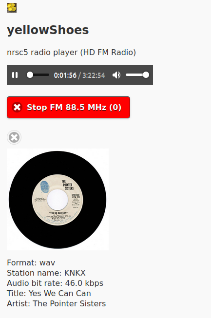
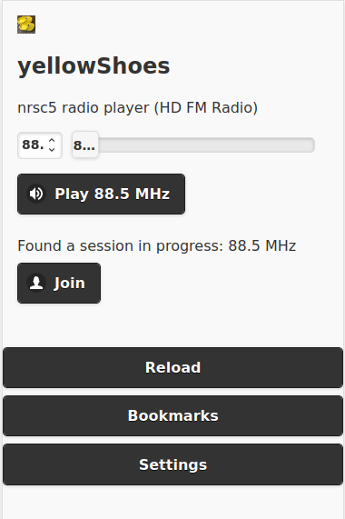
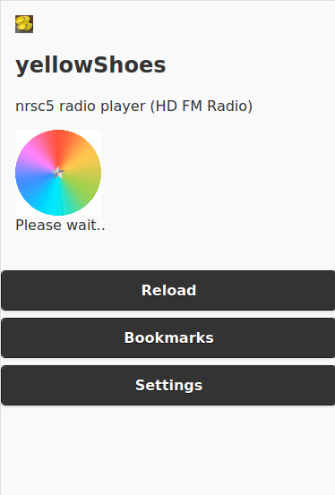
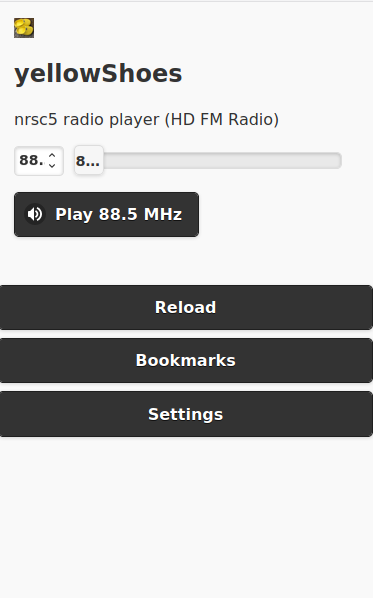
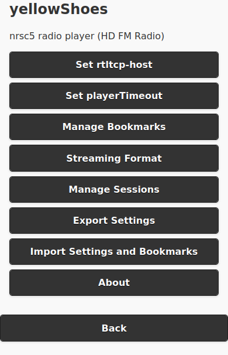
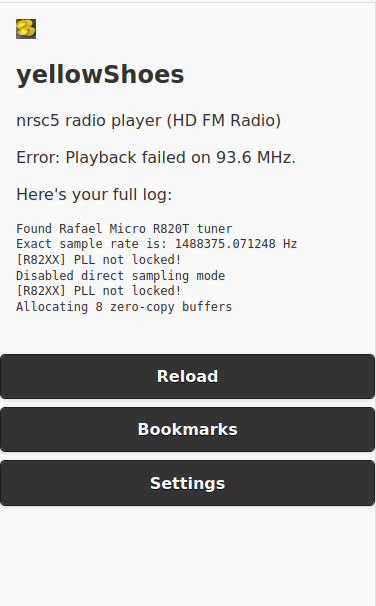

# yellowShoes
nrsc5 (HD FM) radio player - web based, mobile friendly

## Description
If you have an <a href="https://www.amazon.com/gp/product/B011HVUEME">SDR Dongle</a> that can receive <a href="https://en.wikipedia.org/wiki/HD_Radio">NRSC-5</a> digital radio stations, you can use `yellowShoes` as the playback and control UI (User-interface). Navigate to your `yellowShoes` instance from a decent web browser, and you're good to go!

# Requirements
* You must have <a href="https://github.com/theori-io/nrsc5">nrsc5</a> compiled and installed. The `nrsc5` binary must be in your `PATH`. 
* Optional Requirement: If you want mp3 playback (or have IOS devices), you will need `lame` encoder binary in your `PATH`. See [IOS Playback](./IOS/README.md) section.

# New Features 
## Webamp and Milkdrop 
 Equalizer and a Music Visualizer. 


This feature can be enabled from Settings. 


## Album Art


Album art has been enabled as an experimental [feature](https://github.com/evuraan/yellowShoes/issues/7). Album Art tiles works on mobile device lock screens and desktop browsers. 

Enabling this option will make your backend initiate network traffic to search and find cover/album art images. The results we find may be inaccurate or even inappropriate.

Builds that support Album Art are [ kept here](https://github.com/evuraan/yellowShoes/tree/yellowShoes_with_Webamp_Milkdrop/bin).


### Enabling Album Art
You must launch `yellowShoes` with `-enableAlbumArt` to enable album art. 
```bash
$ ./yellowShoes -enableAlbumArt
```
Then navigate to `Settings -> Cover Art` and [enable](./Screenshots/YellowShoes_EnableAlbumArt.png).

# Setup 
* Setup <a href="https://github.com/theori-io/nrsc5">nrsc5</a>  
* Download the `yellowShoes` binary suitable for your Operating System and Platform from [bin folder](https://github.com/evuraan/yellowShoes/tree/yellowShoes_with_Webamp_Milkdrop/bin) of the [yellowShoes_with_Webamp_Milkdrop branch](https://github.com/evuraan/yellowShoes/tree/yellowShoes_with_Webamp_Milkdrop/bin). 

* Launch the  binary you downloaded:
```bash
$ ./yellowShoes -enableAlbumArt 
yellowShoes Ver 4.0a Copyright (C) Evuraan <evuraan@gmail.com>
This program comes with ABSOLUTELY NO WARRANTY.
Using temp dir: /tmp, port: 8113
```
Windows 
```powershell
PS C:\temp\yellowShoes\bin> .\yellowShoes-win-amd64.exe
```

* Launch a browser and navigate to `http://<Your_Address>:Port/main` to launch the UI. Example: `http://192.168.1.134:8113/main`


# Usage

Default port is 8113. If you wish to specify an alternate port or temp directory, use the appropriate input arguments:
```bash
$ ./yellowShoes -h
yellowShoes Ver 4.0a Copyright (C) Evuraan <evuraan@gmail.com>
This program comes with ABSOLUTELY NO WARRANTY.
Usage of ./yellowShoes:
  -enableAlbumArt
    	enable album art
  -port string
    	port to use (default "8113")
  -tempFolder string
    	temp folder with write access to use (default "/tmp")
  -v	print version information and exit
```


# Settings 
## Optional: rtl_tcp
If you have `rtl_tcp` running in your network,  yellowShoes can connect to it - navigate to the <a href='./Screenshots/Settings.png'>settings</a> section to set it up. 


# yellowShoes and Docker
You can run yellowShoes inside a Docker container. See the [Docker section](./Docker). 
# Routing/Proxying
Below example is how I pegged `yellowShoes` behind Apache: 
```bash
<Location /hdFm/>
ProxyPass  http://192.168.1.14:8113/
ProxyPassReverse http://192.168.1.14:8113/
Order deny,allow
Allow from all
Options -Indexes
</Location>
```
This would allow `proto://myapp.dev/hdFm/main` externally. 

# Screenshots 







# References
* https://github.com/markjfine/nrsc5-dui
* https://github.com/theori-io/nrsc5
* https://i.stack.imgur.com/gX0tO.gif
* https://www.rtl-sdr.com/
* https://osmocom.org/projects/rtl-sdr/wiki/Rtl-sdr

# Changelog 
* Aug 2022 - Album Art feature 
* Apr 2023 - Enabling Webamp and Milkdrop
# Thanks:
* Art by Joe Winograd<br>
<a href="http://joetut.com" rel="noreferrer" target="_blank">joetut.com</a> || <a href="http://instagram.com/joewinograd" rel="noreferrer" target="_blank" >instagram.com/joewinograd</a><br>
(For allowing `yellowShoes` to use this wonderful [GIF](./static/wait.gif).)
 
